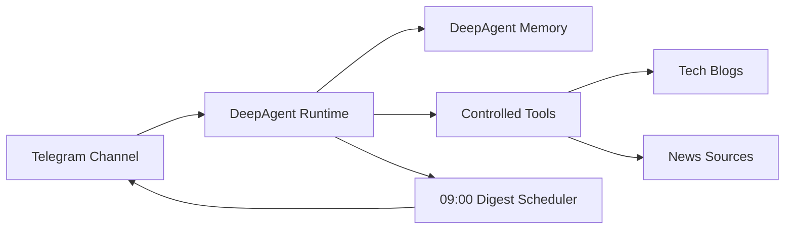

# Yuvenhol Assistant

一个长期运行的个人生活与工作助手。

它不是单纯的聊天机器人，而是一个围绕 `对话`、`长期记忆`、`主动推送` 和 `领域信息处理` 组织起来的单体系统。整体架构按多渠道扩展设计，当前先跑通了 Telegram 最小闭环：

- Telegram Bot 接收消息
- `DeepAgent` 处理对话
- `DeepAgent memory` 保留长期记忆
- 技术博客与新闻抓取作为受控工具提供给 agent
- Telegram Bot 把回复和每日简报发回聊天

更严格的行为边界见 [AGENTS.md](/Users/yuwenhao/Library/Mobile%20Documents/iCloud~md~obsidian/Documents/assistant/AGENTS.md)。

## What It Does

- 当前对话闭环：`Telegram -> DeepAgent -> Telegram`
- 显式长期记忆：只有用户明确要求时才写入长期记忆
- 每日 `09:00` 简报调度
- `tech` 域：最近技术博客更新
- `news` 域：财经、政治、军事、科技新闻聚合
- 默认中文输出
- 简报链接使用文本超链接，不发送裸长链接
- 公开仓库默认收紧安全边界，不以“未配置即开放”的方式运行

## Current Shape



## Project Layout

```text
assistant/
├── AGENTS.md
├── README.md
├── SECURITY.md
├── .env.example
├── pyproject.toml
├── core/
├── channels/
├── skills/
└── tests/
```

- [core/](/Users/yuwenhao/Library/Mobile%20Documents/iCloud~md~obsidian/Documents/assistant/core) 放运行核心、抓取逻辑、digest 生成和 agent runtime
- [channels/](/Users/yuwenhao/Library/Mobile%20Documents/iCloud~md~obsidian/Documents/assistant/channels) 放各渠道接入，当前已实现 Telegram
- [skills/](/Users/yuwenhao/Library/Mobile%20Documents/iCloud~md~obsidian/Documents/assistant/skills) 放 DeepAgent 可读取的 skill 定义
- [tests/](/Users/yuwenhao/Library/Mobile%20Documents/iCloud~md~obsidian/Documents/assistant/tests) 放回归测试

运行时会按需创建 `memories/`，它不属于版本控制内容。

## Quick Start

运行要求：

- Python `3.11+`
- `uv`
- Telegram Bot Token
- OpenAI 兼容接口的 API Key

最少环境变量：

- `TELEGRAM_BOT_TOKEN`
- `OPENAI_API_KEY`
- `ASSISTANT_MODEL`
- `TELEGRAM_ALLOWED_CHAT_IDS`

可选环境变量：

- `OPENAI_BASE_URL`
- `TELEGRAM_PUSH_CHAT_IDS`
- `TELEGRAM_POLL_TIMEOUT_SECONDS`
- `TELEGRAM_REQUEST_TIMEOUT_SECONDS`
- `TELEGRAM_DROP_PENDING_UPDATES`
- `DIGEST_ENABLED`
- `DIGEST_RUN_ON_STARTUP`
- `DIGEST_SCHEDULE_HOUR`
- `DIGEST_TIMEZONE`

示例见 [`.env.example`](/Users/yuwenhao/Library/Mobile%20Documents/iCloud~md~obsidian/Documents/assistant/.env.example)。

启动方式：

```bash
uv python install 3.11
uv sync
set -a && source .env && set +a
uv run python -m channels.telegram.main
```

如果需要启动后立即发一轮简报，可临时设置 `DIGEST_RUN_ON_STARTUP=true`。

## Security Defaults

这是公开仓库，当前安全基线是结构性生效的，不只是文档约定：

- `.env`、`memories/`、`.obsidian/`、日志、数据库和缓存默认不进入版本控制
- bot 启动时必须显式配置 `TELEGRAM_ALLOWED_CHAT_IDS`
- `TELEGRAM_PUSH_CHAT_IDS` 如果单独配置，必须是允许白名单的子集
- 示例配置只能使用占位值
- 当前只支持模拟交易，不接实盘

具体约束见 [SECURITY.md](/Users/yuwenhao/Library/Mobile%20Documents/iCloud~md~obsidian/Documents/assistant/SECURITY.md)。

## Current Gaps

当前还没有做这些能力：

- 用户可配置的通用任务系统
- `market` 域的完整模拟交易闭环
- webhook、Web UI 或多渠道接入
- 更细粒度的长期记忆治理

## Design Choices

- 保持单体进程，不拆服务
- 渠道层保持薄实现，当前先用 Telegram Bot API 长轮询
- 对话理解交给 `DeepAgent`
- 固定流程放在 `core/` 和 `skills/`
- 主动推送由外部调度器触发
- 没有真实内容的域不推送空消息

## Status

当前代码已具备：

- 可运行的 Telegram 对话闭环，后续可扩到飞书、微信等渠道
- 可运行的 09:00 简报调度
- 技术博客与新闻抓取工具
- 安全默认值和回归测试

不要把真实 token、API key、chat id、个人记忆数据或本地运行文件提交到仓库。
